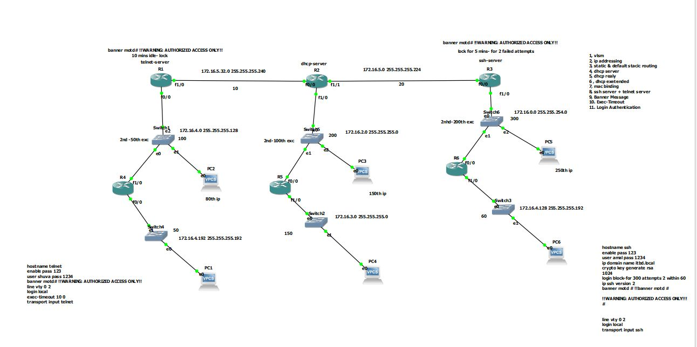

# 🔒 Cisco Static Routing, MAC Binding ও ডিভাইস হার্ডেনিং ল্যাব (GNS3)

এই প্রজেক্টটি **GNS3** প্ল্যাটফর্মে সম্পূর্ণ Cisco ডিভাইস (Router ও Layer 2 Switch) ব্যবহার করে একটি সুরক্ষিত এবং দক্ষতার সাথে পরিচালিত এন্টারপ্রাইজ নেটওয়ার্কের ডিজাইন প্রদর্শন করে। এখানে **Static Routing** এবং **Advanced Device Security** মেকানিজমগুলো বাস্তবায়ন করা হয়েছে।

## প্রজেক্টের উদ্দেশ্য

এই ল্যাবের মূল উদ্দেশ্য হলো আধুনিক নেটওয়ার্কিং কনফিগারেশন ব্যবহার করে নিম্নলিখিত বিষয়গুলো নিশ্চিত করা:
* **Static Routing** ব্যবহার করে দ্রুত ও নিয়ন্ত্রিত ট্র্যাফিক প্রবাহ।
* **MAC Binding (ARP Security)** এবং **SSH** কনফিগারেশনের মাধ্যমে নেটওয়ার্কে উচ্চ স্তরের সুরক্ষা (Security) নিশ্চিত করা।
* এন্টারপ্রাইজ নেটওয়ার্ক পরিচালনার জন্য প্রয়োজনীয় সার্ভিস ও ম্যানেজমেন্ট ফিচারগুলো কনফিগার করা।

---

## 🛠️ বাস্তবায়িত মূল ফিচারসমূহ (Key Features Implemented)

এই ল্যাবে নিম্নলিখিত প্রযুক্তি এবং প্রোটোকলগুলো কনফিগার করা হয়েছে:

### ১. রাউটিং এবং অ্যাড্রেসিং (Routing & Addressing)
* **Static Routing:** নেটওয়ার্কের অভ্যন্তরীণ সাবনেটগুলোর মধ্যে এবং বাইরের নেটওয়ার্কের (ইন্টারনেট) দিকে ট্র্যাফিক পাঠানোর জন্য প্রতিটি রাউটারে ম্যানুয়ালি **স্ট্যাটিক রুট** কনফিগার করা হয়েছে।
* **Default Static Route:** ইন্টারনেট-এ ট্র্যাফিকের জন্য **`ip route 0.0.0.0 0.0.0.0`** ব্যবহার করা হয়েছে।
* **DHCP Server:** ক্লায়েন্টদের স্বয়ংক্রিয়ভাবে IP অ্যাড্রেস, ডিফল্ট গেটওয়ে এবং DNS সার্ভার সরবরাহ করার জন্য **DHCP পুল** কনফিগার করা হয়েছে।

### ২. নেটওয়ার্ক সিকিউরিটি (Security & Hardening)
* **MAC Binding (ARP Security):** **IP অ্যাড্রেসের সাথে MAC অ্যাড্রেসের বাঁধাই** (Binding) কনফিগার করা হয়েছে। এর মাধ্যমে শুধুমাত্র অনুমোদিত ডিভাইসগুলো নেটওয়ার্কে অ্যাক্সেস করতে পারবে, যা ARP Spoofing প্রতিরোধে অত্যন্ত কার্যকর।
* **Secure Remote Access (SSH):** নেটওয়ার্ক ডিভাইসগুলোতে দূরবর্তী ব্যবস্থাপনার জন্য অনিরাপদ **Telnet**-এর পরিবর্তে **SSH (Secure Shell)** কনফিগার করা হয়েছে।
* **Login Authentication:** ডিভাইস কনসোলে প্রবেশের সময় লোকাল ইউজারনেম এবং পাসওয়ার্ড বা সিক্রেট পাসওয়ার্ড ব্যবহার করে লগইন অথেন্টিকেশন নিশ্চিত করা হয়েছে।

### ৩. ডিভাইস ম্যানেজমেন্ট (Device Management)
* **Banner MOTD (Message of the Day):** ডিভাইসে লগইন করার সময় একটি আইনি সতর্কতা বা গুরুত্বপূর্ণ বার্তা দেখানোর জন্য **`banner motd`** কনফিগার করা হয়েছে।
* **Exec-Timeout:** একটি নির্দিষ্ট সময়ের জন্য ইনঅ্যাক্টিভ থাকার পর সেশনগুলো স্বয়ংক্রিয়ভাবে লগআউট করার জন্য **`exec-timeout`** কনফিগারেশন করা হয়েছে, যা ডিভাইস ম্যানেজমেন্টের নিরাপত্তা বাড়ায়।
* **Telnet:** ভিসিটিওয়াই (VTY) লাইনের জন্য প্রয়োজনীয় অ্যাক্সেস কন্ট্রোল কনফিগার করা হয়েছে (যদি না SSH-কে একমাত্র বিকল্প করা হয়)।

---

## 📂 ফাইল বিবরণ

* **Cisco-Static-MACBinding-ssh-gns3.zip:** এটি এই প্রজেক্টের মূল GNS3 প্রজেক্ট ফাইল।

## ⬇️ ডাউনলোড লিঙ্ক

[**GNS3 প্রজেক্ট ফাইল ডাউনলোড করুন**](https://github.com/shuvacst/shuvacst.projects/raw/refs/heads/main/Cisco-Static-MACBinding-ssh-gns3/Cisco-Static-MACBinding-ssh-gns3.zip)

## 💡 কীভাবে ব্যবহার করবেন

1.  প্রজেক্ট ফাইলটি ডাউনলোড করুন এবং আনজিপ করুন।
2.  আপনার কম্পিউটারে **GNS3** সফটওয়্যারটি ইনস্টল করা আছে কিনা নিশ্চিত করুন।
3.  GNS3 সফটওয়্যারে ফাইলটি **Import** করুন।
4.  ডিভাইসগুলো চালু (Start) করে নিম্নলিখিত কনফিগারেশনগুলোর কার্যকারিতা পরীক্ষা করুন:
    * **DHCP:** PC-গুলো স্বয়ংক্রিয়ভাবে সঠিক IP অ্যাড্রেস পাচ্ছে কিনা।
    * **Routing:** যেকোনো PC থেকে ইন্টারনেট (Cloud) বা অন্য সাবনেটে পিং (Ping) করে দেখুন।
    * **Security:** SSH ব্যবহার করে রাউটারে লগইন করুন এবং MAC Binding পরীক্ষা করার জন্য একটি নতুন/অনুমোদিত নয় এমন পিসি সংযোগ করে দেখুন।
