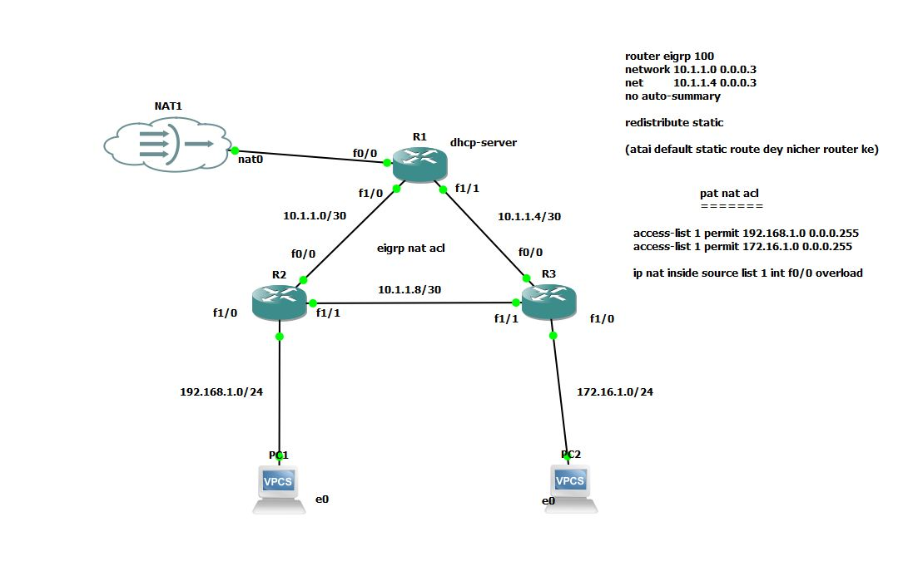

# 💻 প্রজেক্ট: GNS3 ব্যবহার করে EIGRP, NAT (PAT) এবং ACL কনফিগারেশন

এই প্রজেক্টটি **GNS3** (Graphical Network Simulator) ব্যবহার করে একটি বাস্তবসম্মত এন্টারপ্রাইজ নেটওয়ার্কের ডিজাইন এবং কনফিগারেশন প্রদর্শন করে। এই ল্যাবে ডাইনামিক রাউটিং (EIGRP), নেটওয়ার্ক অ্যাড্রেস ট্রান্সলেশন (NAT/PAT) এবং ট্র্যাফিক ফিল্টারিং (ACL) বাস্তবায়ন করা হয়েছে।

## প্রজেক্টের উদ্দেশ্য

এই নেটওয়ার্কের মূল উদ্দেশ্য হলো আধুনিক নেটওয়ার্কিং প্রযুক্তি ব্যবহার করে অভ্যন্তরীণ (Private) নেটওয়ার্কগুলো থেকে নিরাপদে বাইরের (Internet) নেটওয়ার্কে যোগাযোগ নিশ্চিত করা এবং একটি গতিশীল, নির্ভরযোগ্য ও সুরক্ষিত রাউটিং ব্যবস্থা স্থাপন করা।

## 🛠️ বাস্তবায়িত মূল ফিচারসমূহ (Key Features Implemented)

এই ল্যাবে নিম্নলিখিত প্রযুক্তি এবং প্রোটোকলগুলো কনফিগার করা হয়েছে:

### ১. রাউটিং প্রোটোকল:
* **EIGRP (Enhanced Interior Gateway Routing Protocol):** নেটওয়ার্কের বিভিন্ন অংশের মধ্যে দ্রুত কনভারজেন্স সহ ডাইনামিক রাউটিংয়ের জন্য **Autonomous System 100** ব্যবহার করা হয়েছে।
* **Default Route Redistribution:** **R1** রাউটার থেকে ইন্টারনেট-এর দিকে একটি **Default Static Route** কনফিগার করে সেটি EIGRP-এর মাধ্যমে অন্য রাউটারগুলোতে (R2, R3) **Redistribute Static** করা হয়েছে।

### ২. নেটওয়ার্ক অ্যাড্রেস ট্রান্সলেশন (NAT):
* **PAT (Port Address Translation) - Overload:** অভ্যন্তরীণ নেটওয়ার্ক (`192.168.1.0/24` এবং `172.16.1.0/24`) থেকে আসা একাধিক ট্র্যাফিককে R1-এর **একটি মাত্র পাবলিক IP** ব্যবহার করে বাইরে পাঠানোর জন্য PAT কনফিগার করা হয়েছে।
* **Inside/Outside Interface:** R1-এর F0/0 ইন্টারফেসকে `ip nat outside` এবং F1/0 ও F1/1 ইন্টারফেসগুলোকে `ip nat inside` হিসেবে সেট করা হয়েছে।

### ৩. নেটওয়ার্ক সিকিউরিটি (ACL):
* **Standard ACL (Access-list 1):** NAT-এর জন্য অভ্যন্তরীণ অ্যাড্রেসগুলোকে সংজ্ঞায়িত করতে একটি Standard ACL ব্যবহার করা হয়েছে। ACL-এর মাধ্যমে **192.168.1.0/24** এবং **172.16.1.0/24** নেটওয়ার্কের ট্র্যাফিক পারমিট করা হয়েছে।
* **Traffic Control:** এই ACL শুধুমাত্র NAT-এর জন্য ব্যবহার করা হলেও, এটি নেটওয়ার্ক ট্র্যাফিক ফিল্টারিংয়ের একটি গুরুত্বপূর্ণ ধাপ।

---

## 📂 ফাইল বিবরণ

* **eigrp-nat-acl-30-10-25.zip:** এটি এই প্রজেক্টের মূল GNS3 ফাইল। এটি ডাউনলোড করে আপনি সম্পূর্ণ টপোলজি এবং প্রতিটি ডিভাইসের কনফিগারেশন পরীক্ষা করতে পারবেন।

## ⬇️ ডাউনলোড লিঙ্ক

[**GNS3 প্রজেক্ট ফাইল ডাউনলোড করুন**](https://github.com/shuvacst/shuvacst.projects/raw/refs/heads/main/eigrp-nat-acl-30-10-25/eigrp-nat-acl-30-10-25.zip)

## 💡 কীভাবে ব্যবহার করবেন

1.  প্রজেক্ট ফাইলটি ডাউনলোড করুন এবং আনজিপ করুন।
2.  আপনার কম্পিউটারে **GNS3** সফটওয়্যারটি ইনস্টল করা আছে কিনা নিশ্চিত করুন।
3.  GNS3 সফটওয়্যারে ফাইলটি **Import** করুন।
4.  GNS3-তে ডিভাইসগুলো চালু (Start) করে প্রতিটি রাউটার ও পিসির কনফিগারেশন ও সংযোগ পরীক্ষা করুন। যেমন: PC1 বা PC2 থেকে ইন্টারনেটে পিং (Ping) করে দেখুন।
