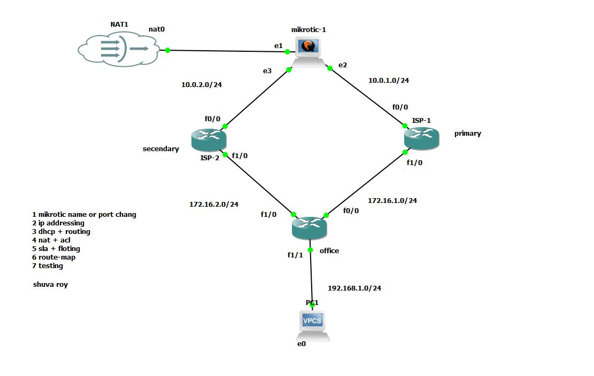

# 🌐 প্রজেক্ট: GNS3-এ MikroTik এবং Cisco রাউটারের সমন্বয়ে ডুয়াল-হোমড ইন্টারনেট ডিজাইন

এই প্রজেক্টটি **GNS3** ব্যবহার করে একটি অ্যাডভান্সড নেটওয়ার্ক ডিজাইন প্রদর্শন করে, যেখানে একই নেটওয়ার্কে **MikroTik** এবং **Cisco** রাউটার একসঙ্গে কাজ করছে। এটি মূলত **ডুয়াল-হোমড (Dual-Homed)** ইন্টারনেট কানেক্টিভিটি এবং **WAN রিডানডেন্সি** নিশ্চিত করার জন্য তৈরি করা হয়েছে।

## প্রজেক্টের উদ্দেশ্য

এই নেটওয়ার্কের মূল উদ্দেশ্য হলো দুটি ভিন্ন **ISP (Internet Service Provider)** ব্যবহার করে উচ্চ প্রাপ্যতা (High Availability) নিশ্চিত করা। কোনো একটি WAN লিংক ফেল করলে যেন ট্র্যাফিক স্বয়ংক্রিয়ভাবে অন্য লিংকের মাধ্যমে প্রবাহিত হয়, সেই ব্যবস্থা স্থাপন করা।

## 🛠️ বাস্তবায়িত মূল ফিচারসমূহ (Key Features Implemented)

এই ল্যাবে নিম্নলিখিত প্রযুক্তি এবং প্রোটোকলগুলো কনফিগার করা হয়েছে:

### ১. ডুয়াল-হোমড WAN রিডানডেন্সি:
* **ISP কনফিগারেশন:** MikroTik এবং Cisco Router (ISP-1 ও ISP-2) এর মাধ্যমে দুটি স্বতন্ত্র ইন্টারনেট সার্ভিস প্রদানকারীকে সিমুলেট করা হয়েছে।
* **Primary/Backup রুট:** প্রধান (Primary) এবং ব্যাকআপ (Backup) রুট কনফিগার করা হয়েছে। প্রাইমারি লিংক ডাউন হলে ট্র্যাফিক স্বয়ংক্রিয়ভাবে ব্যাকআপ লিংকে চলে যাবে।

### ২. রাউটিং এবং ট্র্যাকিং:
* **Static Routing:** WAN এবং LAN ইন্টারফেসগুলোর জন্য স্ট্যাটিক রুট কনফিগার করা হয়েছে।
* **IP SLA (Service Level Agreement):** Cisco রাউটারে **IP SLA** ব্যবহার করে সক্রিয়ভাবে প্রাইমারি ISP-এর কানেক্টিভিটি নিরীক্ষণ করা হয়েছে।
* **Track:** IP SLA-এর মাধ্যমে কানেক্টিভিটি ট্র্যাকে রাখা হয়েছে এবং প্রাইমারি লিংক ডাউন হলে ফ্লোটিং স্ট্যাটিক রুট (Floating Static Route) সক্রিয় করার জন্য রুট ম্যাট্রিক পরিবর্তন করা হয়েছে।

### ৩. নেটওয়ার্ক সার্ভিস (NAT):
* **Dynamic NAT (PAT):** অফিস নেটওয়ার্কের (LAN) প্রাইভেট অ্যাড্রেসগুলোকে পাবলিক অ্যাড্রেসে ট্রান্সলেট করার জন্য **Port Address Translation (PAT)** ব্যবহার করা হয়েছে।

### ৪. আইপি অ্যাড্রেসিং এবং সাবনেটিং:
* **VLSM:** নেটওয়ার্কের বিভিন্ন অংশের (WAN, LAN, ইন্টার-রাউটার কানেকশন) জন্য VLSM (Variable Length Subnet Masking) ব্যবহার করা হয়েছে।
* **DHCP Server:** অফিস LAN-এর ক্লায়েন্টদের স্বয়ংক্রিয়ভাবে আইপি অ্যাড্রেস বিতরণের জন্য একটি **DHCP সার্ভার** স্থাপন করা হয়েছে।

---

## 📂 ফাইল বিবরণ

* **mikrotic+cisco-29-10-25-gns3.zip:** এটি এই প্রজেক্টের মূল GNS3 প্রজেক্ট ফাইল। এটি ডাউনলোড করে আপনি সম্পূর্ণ টপোলজি এবং MikroTik ও Cisco ডিভাইসের কনফিগারেশন দেখতে পারবেন।

## ⬇️ ডাউনলোড লিঙ্ক

[**GNS3 প্রজেক্ট ফাইল ডাউনলোড করুন**](https://github.com/shuvacst/shuvacst.projects/raw/refs/heads/main/mikrotic+cisco-29-10-25-gns3/mikrotic+cisco-29-10-25-gns3.zip)

## 💡 কীভাবে ব্যবহার করবেন

1.  প্রজেক্ট ফাইলটি ডাউনলোড করুন এবং আনজিপ করুন।
2.  আপনার কম্পিউটারে **GNS3** সফটওয়্যারটি ইনস্টল করা আছে কিনা নিশ্চিত করুন।
3.  GNS3 সফটওয়্যারে ফাইলটি **Import** করুন।
4.  ডিভাইসগুলো চালু (Start) করে **IP SLA** এবং **WAN Failover** কনফিগারেশনগুলো পরীক্ষা করুন। একটি ISP লিংক ম্যানুয়ালি শাটডাউন করে দেখুন ট্র্যাফিক সঠিকভাবে অন্য লিংকে যাচ্ছে কিনা।
